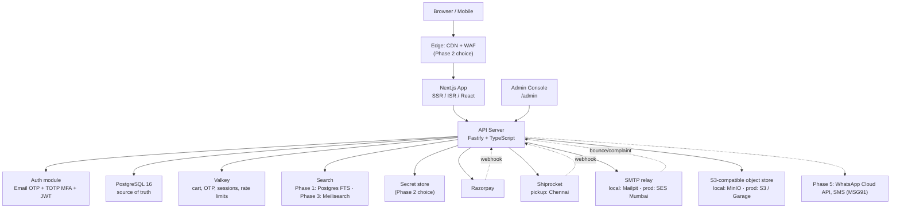

# Puja Essentials — Platform Design Document

|                    |                                                                                                                                                                                                                 |
| ------------------ | --------------------------------------------------------------------------------------------------------------------------------------------------------------------------------------------------------------- |
| **Status**         | Draft v1.3                                                                                                                                                                                                      |
| **Date**           | 2026-09-25                                                                                                                                                                                                      |
| **Scope**          | V1 — India-only shipping and payments · login required before checkout · email-only notifications · dispatch from Chennai, Tamil Nadu · **Phase 1 is code only, hosting-agnostic; deployment is its own phase** |
| **Reference site** | https://devdarshandhoop.com/ (Shopify storefront, crawled end-to-end)                                                                                                                                           |
| **Live blueprint** | https://claude.ai/artifact/2ZwGwbzYRNyaz7DFPVxjyR                                                                                                                                                               |

**i18n note:** Phase 1 ships English only; Hindi + Tamil arrive in Phase 4. The translation tables (§7) and Tamil font pairing (§16) are pre-specified so Phase 4 is additive, not a rewrite. Implementation plans live in `docs/plans/`.
**v1.3 changes:** deployment split out of Phase 1 into a new **Phase 2 — Deployment & Go-Live**; all infrastructure choices (AWS tier vs open-source VPS, WAF, secrets store, backups, VAPT, SES domain) move there with a tier-decision table (§14). Phase 1 is now code development on docker-compose with explicit hosting-agnostic rules (§4.2). Later phases renumbered: Growth → 3, Scale & Delight → 4, Deferred messaging → 5. §11 gains a code-vs-platform control mapping (§11.6). Cost §6 separates development (≈ ₹0 infra) from deployment.
**v1.2:** decisions applied — placeholder brand + minimalist direction, admin console + spreadsheet import, Chennai origin, login-required checkout, fixed returns policy, blog in search, SES email. **v1.1:** WhatsApp/SMS/share row deferred; security architecture + independent review; licensing & cost; Tamil in i18n.

---

## 1. Brief

Design and deliver a complete end-to-end architecture for **Puja Essentials**, a custom-built Indian devotional-goods e-commerce platform. The site must offer a feature set and user experience comparable to devdarshandhoop.com, but be built entirely on a custom-owned stack — no Shopify, no hosted store-builder. India-only shipping and payments are the full scope for V1.

This document is the output of a live browser crawl of the reference site (homepage, collections, product detail, cart, login, account, blog, and every policy/footer page). Every workflow in §3 was verified against the live site before being written down.

---

## 2. Reference Site Analysis

### 2.1 Global UI patterns observed

| Element          | Behaviour                                                                                          |
| ---------------- | -------------------------------------------------------------------------------------------------- |
| Announcement bar | Sticky top stripe: "Free Shipping on Orders Above ₹599/-"                                          |
| Social row       | Facebook, Instagram, YouTube, X, LinkedIn above the nav                                            |
| Header icons     | Search, Wishlist (heart), Account, Cart (bag with live count)                                      |
| Mega-menu nav    | 6 top-level categories, each with 8–14 sub-collections and an "Explore All" link                   |
| Slide-out cart   | Drawer titled "My cart • N" — items, qty stepper, remove, subtotal, checkout CTA                   |
| Promo popup      | Delayed modal ("BUY 1, GET 1 FREE") with product image, price, Add to Cart; shown once per session |
| Footer           | Business info (GSTIN, Udyam), category links, quick links, policy links, newsletter                |

### 2.2 Category taxonomy (6 top-level + More)

```
Agarbatti       → Bambooless, Premium, Royale Masala, Royale Luxury, Pouch/Tube/Sleeve/Roll/Hexa packs,
                  Long Garden, Mosquito Repellent, Flora, Combos
Dhoop           → Wet Dhoop, Dhoop Sticks, Dhoop Stick Jar, Perfume Dhoop, Stem Sticks, Dhoop Cones,
                  Masala Cones, Tube/Jar/Roll/Pouch packs, Combos
Puja Samagri    → Camphor, Kapur Dani, Lubaan Daani, Sambrani Hawan Cups, Wet Tika, Dry Tika,
                  Puja Wick, Hawan Samagri, Gangajal, Shining Powder, Smudge Stick, Combos
Air Care        → Bulb Diffusers, Aroma Oils (bulb), Humidifiers, Aroma Oils (ultrasonic),
                  Reed Diffusers, Car Diffusers, Room Freshener Spray, Combos
Home Fragrance  → Scented Candles, Gel Fresheners, Bakhoor, Combos
Body Fragrance  → Belle Essence Parfum, Perfumes (Men / Women), Attar, Combos
More            → Backflow Incense Burners, Gifting Items, Festive Special, Nirvana Aromatic Indulgence
```

### 2.3 Homepage composition (top → bottom)

1. Social row + announcement bar
2. Sticky header — logo, mega menu, search, wishlist, account, cart
3. Hero (single large product still under the minimalist direction)
4. Category grid
5. Best Sellers — product cards with inline qty stepper + Add to Cart
6. Brand block
7. Knowledge Hub (blog) preview
8. Newsletter subscription bar
9. Footer
10. Promotional popup (off by default)

### 2.4 Product detail page anatomy

- Breadcrumb: Home / All / Product
- Image gallery (main + thumbnails)
- Title, SKU (e.g. `DD437`), sale price vs. compare-at price, "(incl. of all taxes)"
- Variant selector, quantity stepper, **Add to Cart**, **Buy it Now**
- Add to Wishlist + "Share now" row — **share row deferred to Phase 5**
- Description, Specifications (Quantity / Commodity / Product Code / Brand / Manufacturer address), How to Use
- Ratings summary + reviews with "Verified purchase"
- Manufacturer's Note
- "You May Also Like" carousel

### 2.5 Collection page anatomy

- Breadcrumb, title, item count
- Price filter, sort dropdown, grid/list toggle
- Product card: image, Sale badge, title, price pair, inline qty stepper, Add to Cart, wishlist heart

### 2.6 Business & compliance facts observed → our V1

| Area        | Reference site                                                                    | Our V1                                                                                   |
| ----------- | --------------------------------------------------------------------------------- | ---------------------------------------------------------------------------------------- |
| Payments    | Razorpay. No COD. Partial-payment at selected PINs.                               | Razorpay hosted Checkout, no COD; partial pay in Phase 4                                 |
| Shipping    | India only, 5–7 days, dispatched from Chandigarh, tracking via Email + WhatsApp   | India only, dispatched from **Chennai, TN**; tracking via **email**; WhatsApp in Phase 5 |
| Auth        | Passwordless email OTP; guest checkout allowed                                    | Same OTP UX, custom build; **login required before checkout**                            |
| Returns     | Refund & Return page, ~15 days implied                                            | 15 days from delivery, defects only, seller pays pickup for defects (§10)                |
| Legal pages | Shipping, Refund & Return, Privacy, T&C, Pricing, Grievance, FAQ, Become a Seller | Same set                                                                                 |
| Blog        | "Knowledge Hub"                                                                   | Phase 3, indexed in search                                                               |

---

## 3. User Workflows & Use Cases

Priority: **Critical** = launch blocker · **High** = V1 must-have · **Medium** = V1.5 · **Phase 5** = deferred

### WF-01 · Browse & discovery — Critical

Homepage → mega-menu → collection (filter/sort) → PDP (images, description, reviews, related). No login needed.

### WF-02 · Search — High

Overlay with live autocomplete over products and categories (Phase 1: Postgres full-text; Phase 3: Meilisearch, adds blog articles); results page grouped by type; "no results" suggests popular categories.

### WF-03 · Cart — Critical

Add from collection or PDP → drawer (qty, remove, subtotal, free-shipping bar at ₹599) → "Continue to Checkout". Guest carts persist 7 days in Valkey; merged into the user cart at login.

### WF-04 · Checkout & payment — Critical (login required)

0. "Continue to Checkout" with no session → `/login?redirect=/checkout` → OTP → cart merge → `/checkout`
1. Contact pre-filled from account; phone required (+91, 10 digits)
2. Address: pick a saved address or add one; 6-digit PIN checked for serviceability from Chennai
3. Shipping method with ETA (South India 2–4 days, rest 4–7)
4. Optional coupon
5. Summary — items, shipping, **CGST+SGST (Tamil Nadu destinations) or IGST (other states)**, total — computed server-side
6. Payment: UPI / Net Banking / Card / Wallet (partial pay Phase 4)
7. Razorpay hosted Checkout → pay
8. `/checkout/success/[orderId]` (session-scoped) + confirmation email

- Edge: payment failed → `PENDING`, retry 30 min, then auto-cancel; the release job returns stock **and** coupon usage
- Edge: price/stock drift → re-validate at order creation and show the diff
- Edge: retries → `Idempotency-Key` returns the same order

### WF-05 · Registration & login — Critical

Email → OTP (6 digits, 10-min TTL, 3 sends / 10 min) → verify (5 attempts) → JWT + refresh cookie → redirect (relative paths only). First success creates the account. Session ID regenerated; guest cart merged.

### WF-06 · Account — High

Orders (list, detail with timeline + Track Order), addresses, security page (sessions, log out all, delete account, export data), return requests.

### WF-07 · Wishlist — High

Heart on card/PDP; guest → localStorage (variant IDs only), user → server; header count.

### WF-08 · Promotional popup — Medium

Admin-configured; off by default under the minimalist direction (§16); once per session; BOGO auto-applies in cart.

### WF-09 · Reviews — High

Aggregate rating, star breakdown, verified-purchase reviews; submit only when the buyer's own order item is `DELIVERED`; admin moderation.

### WF-10 · Blog / Knowledge Hub — Medium

Listing + article (sanitised rich text), collection CTAs, `Article` JSON-LD; indexed in search (Phase 3).

### WF-11 · Order tracking — High

Dispatch email with tracking ID + courier link → `/account/orders/[id]` (login) → Track Order (allow-listed courier domains). Status: `PENDING → CONFIRMED → DISPATCHED → IN_TRANSIT → DELIVERED`; side branches `CANCELLED`, `RETURNED`. Shiprocket webhook drives transit states.

### WF-12 · Static pages & policies — High

About · Contact · FAQ · Grievance Redressal · Shipping · Refund & Return · Privacy · T&C · Pricing · Become a Seller.

### WF-13 · Newsletter — Medium

Footer subscribe; opt-in unchecked by default; idempotent; honeypot + rate limit; unsubscribe link in every send.

### WF-14 · Admin console — Critical

Email OTP **plus mandatory TOTP MFA**; navigation and role matrix in §8.1; every mutation audited.

### WF-15 · Returns & refunds — High (policy fixed)

1. From `/account/orders/[id]` within **15 days of `DELIVERED`**, the customer opens a return request per item: reason ∈ {damaged in transit, wrong item, expired at delivery}, description, 1–4 photos (uploaded through the hardened media pipeline, §11.3). Change-of-mind is **not eligible** and the form says so up front with a link to the policy.
2. Admin/Staff reviews within 2 business days → approve (choose refund or replacement) or reject with reason.
3. Approved → Shiprocket reverse pickup booked from the customer address; **seller bears pickup cost**.
4. Received at Chennai → QC. QC pass → Razorpay refund to the original method (5–7 business days) or replacement dispatched. QC fail (item not defective) → refund minus the reverse-pickup charge (≈ ₹40–80), with the deduction itemised.
5. Email at every state change; full history on the order page.

### WF-16 · Messaging & sharing — Phase 5

WhatsApp order/tracking messages and support widget; SMS OTP fallback; PDP share row.

### WF-17 · Admin product import (spreadsheet) — Critical

1. Admin → Import / Export → download the CSV/XLSX template
2. Upload file (≤ 5 MB, ≤ 5,000 rows; CSV UTF-8 or XLSX)
3. Server parses with cells treated as text (no formula evaluation), validates each row with Zod, and returns a **dry-run report**: rows to create, rows to update (by SKU), errors with line numbers
4. Admin confirms (step-up re-auth, since this is a bulk price change) → transactional upsert by SKU → `StockMovement` rows for stock changes → `ImportJob` record + audit log
5. Images are attached separately through the bulk media uploader, matched by filename `SKU-1.jpg`, `SKU-2.jpg` …
6. Export: products (CSV) for STAFF/ADMIN; orders and customers exports are ADMIN + step-up, PII-minimised, and logged

---

## 4. System Architecture

The logical architecture is fixed; where each box _runs_ is decided in Phase 2 (§14). Phase 1 runs all of it on docker-compose.



### 4.1 Development environment (Phase 1)

| Service       | Local (docker-compose)                     | Purpose                                                   |
| ------------- | ------------------------------------------ | --------------------------------------------------------- |
| `web`         | Next.js dev server                         | Storefront + `/admin`                                     |
| `api`         | Fastify with hot reload                    | REST API, jobs, webhooks                                  |
| `postgres`    | PostgreSQL 16                              | Source of truth; migrations via Prisma                    |
| `valkey`      | Valkey 8                                   | Cart, OTP, sessions, rate limits, idempotency             |
| `minio`       | MinIO (S3 API)                             | Presigned uploads and media, same code path as production |
| `mailpit`     | SMTP sink with web UI + API                | OTP and order emails; E2E tests read OTPs from its API    |
| `meilisearch` | Meilisearch (Phase 3 only)                 | Search index                                              |
| Razorpay      | Test-mode keys + recorded webhook fixtures | No sandbox needed; webhooks replayed locally              |
| Shiprocket    | Fake adapter behind the shipping port      | No sandbox exists; recorded responses for contract tests  |

### 4.2 Hosting-agnostic rules (enforced in Phase 1 so Phase 2 is configuration, not rework)

1. **All configuration via environment variables**, validated with Zod at boot; a `.env.example` lists every key. No cloud SDK is called for configuration.
2. **Object storage through the S3 API only** (presigned PUT/GET, bucket + prefix from env). Works unchanged on MinIO, AWS S3, Garage.
3. **Email through an `EmailPort` with an SMTP transport** (nodemailer). Mailpit locally, SES SMTP in production, any relay later. Bounce/complaint ingestion is an adapter added in Phase 2.
4. **Field-level encryption through a `KeyProvider`**: local static key from env in development; KMS (or SOPS/age-managed key) adapter in Phase 2. Blind indexes use the same provider.
5. **Secrets are read from env**; how they get into env (SSM, Secrets Manager, SOPS) is Phase 2.
6. **Stateless containers** with `Dockerfile`s for `web` and `api`, built in CI; health endpoints (`/healthz`, `/readyz`); structured JSON logs to stdout with redaction; Prisma migrations runnable as a one-shot job.
7. **Search behind a `SearchPort`**: Postgres full-text implementation in Phase 1; Meilisearch adapter in Phase 3.
8. **No platform-specific security assumptions**: CSP/headers, rate limits, CSRF, input validation and sanitisation are all in application code, not delegated to a WAF.
9. **Error tracking via the Sentry SDK** with an optional DSN (empty locally); the backend (Sentry or GlitchTip) is chosen in Phase 2.
10. **Observability hooks**: request IDs, latency histograms and business counters exposed via a metrics endpoint (Prometheus format); dashboards wired in Phase 2.

---

## 5. Tech Stack

| Layer                    | Choice                                                                                      | Rationale                                                                                                                      |
| ------------------------ | ------------------------------------------------------------------------------------------- | ------------------------------------------------------------------------------------------------------------------------------ |
| Frontend                 | Next.js 15 (App Router), React 19, TypeScript, Tailwind CSS                                 | ISR for SEO-critical pages                                                                                                     |
| Client state             | Zustand                                                                                     | Cart + wishlist UI state                                                                                                       |
| Server state             | TanStack Query                                                                              | Caching, optimistic updates                                                                                                    |
| Forms                    | React Hook Form + Zod                                                                       | Checkout, address, admin forms                                                                                                 |
| i18n                     | `next-intl`                                                                                 | English only in Phase 1 with the `[locale]` route segment already in place; Hindi + Tamil in Phase 4 (additive, not a rewrite) |
| API                      | Node 22, Fastify, TypeScript                                                                | Fast, schema-first                                                                                                             |
| Validation               | Zod (shared package)                                                                        | Every boundary                                                                                                                 |
| ORM                      | Prisma                                                                                      | Parameterised queries, migrations                                                                                              |
| Database                 | PostgreSQL 16                                                                               | ACID for orders and stock; `tsvector` + `pg_trgm` for Phase 1 search                                                           |
| Cache                    | Valkey 8                                                                                    | Cart, OTP, refresh sessions, rate limits, idempotency keys                                                                     |
| Search (Phase 3)         | Meilisearch                                                                                 | Typo-tolerant; indexes products, categories, blog posts                                                                        |
| Auth                     | Custom email OTP → JWT (RS256, 15 min) + rotating refresh; TOTP MFA for admin               | Matches reference UX; no vendor lock-in                                                                                        |
| Payments                 | Razorpay hosted Checkout                                                                    | UPI, cards, net banking, wallets, EMI; PCI SAQ-A                                                                               |
| Shipping                 | Shiprocket behind a `ShippingPort`                                                          | Multi-courier, PIN serviceability, webhooks; pickup Chennai                                                                    |
| Email                    | `EmailPort` → nodemailer SMTP; Mailpit locally, **AWS SES (ap-south-1) SMTP** in production | Data stays in India; $0.10 / 1,000; relay is swappable                                                                         |
| Object storage           | S3 API via AWS SDK v3 client; MinIO locally, S3 or Garage in production                     | Presigned uploads unchanged across providers                                                                                   |
| Import                   | `papaparse` (CSV), `exceljs` (XLSX)                                                         | MIT; cells read as text, no formula evaluation                                                                                 |
| Media                    | Sharp + `file-type`                                                                         | Re-encode, strip metadata, magic-byte check                                                                                    |
| Sanitisation             | `sanitize-html`, Tiptap schema validation                                                   | Rich text for products and blog                                                                                                |
| Admin                    | Next.js `/admin`, Tiptap core, Recharts, `otplib`                                           | Role- and MFA-gated                                                                                                            |
| Security tooling (CI)    | Semgrep, gitleaks, Trivy, Renovate, `pnpm audit`                                            | Gates on every PR                                                                                                              |
| Testing                  | Vitest, Playwright, Testing Library, Testcontainers                                         | 80%+ coverage                                                                                                                  |
| **Phase 2 (deployment)** | Hosting tier, CDN/WAF, secret store, backups, monitoring backend — see §14                  | Decided at deployment                                                                                                          |
| **Phase 5 (deferred)**   | WhatsApp Cloud API, MSG91 SMS + DLT                                                         | Notifications, OTP fallback                                                                                                    |

---

## 6. Licensing & Cost

Indicative list prices; verify with vendor calculators. ₹ figures assume ≈ ₹84/$.

### 6.1 Phase 1 — development: ≈ ₹0 infrastructure

Everything runs locally on docker-compose. Razorpay test mode and GitHub Actions' free tier cost nothing. Only a domain (≈ ₹800–1,500/yr) is worth buying early so SES domain verification can start in Phase 2 without delay.

### 6.2 Free / open-source software (all phases)

| Component                                                                                                              | Licence                       | Note                                                                          |
| ---------------------------------------------------------------------------------------------------------------------- | ----------------------------- | ----------------------------------------------------------------------------- |
| Next.js, React, TypeScript, Tailwind, Zustand, TanStack Query, React Hook Form, Zod, next-intl                         | MIT                           | —                                                                             |
| Node.js, Fastify, Prisma, Sharp, sanitize-html, otplib, file-type, papaparse, exceljs, nodemailer                      | MIT / Apache-2                | —                                                                             |
| PostgreSQL                                                                                                             | PostgreSQL licence            | —                                                                             |
| Valkey                                                                                                                 | BSD-3                         | Redis ≥ 7.4 is source-available, Redis 8 is AGPL — Valkey avoids the question |
| Meilisearch                                                                                                            | MIT                           | Phase 3                                                                       |
| MinIO / Garage                                                                                                         | AGPL                          | Local dev (MinIO); Garage is the lighter self-host option                     |
| Mailpit                                                                                                                | MIT                           | Local SMTP sink                                                               |
| Tiptap core, Recharts                                                                                                  | MIT                           | Tiptap Pro extensions are paid — not used                                     |
| Vitest, Playwright, Testing Library, Testcontainers                                                                    | MIT                           | —                                                                             |
| Semgrep OSS rules, gitleaks, Trivy, Renovate                                                                           | LGPL / MIT / Apache-2         | —                                                                             |
| Caddy / Traefik, Coraza, CrowdSec, pgBackRest / WAL-G, SOPS + age, Dokploy / Coolify, GlitchTip, Uptime Kuma, Listmonk | Apache-2 / MIT / MPL-2 / AGPL | Open-source deployment options evaluated in Phase 2                           |

### 6.3 Paid — from Phase 2 (deployment) onward

| Component                                                                                      | Pricing model                                                                                                                              | Indicative cost         |
| ---------------------------------------------------------------------------------------------- | ------------------------------------------------------------------------------------------------------------------------------------------ | ----------------------- |
| **Razorpay**                                                                                   | ~2% + 18% GST on the fee (standard plan); ~3% international, Amex, EMI                                                                     | ≈ 2.4% of GMV           |
| **Shiprocket**                                                                                 | Free Lite + per-shipment; paid plans ~₹1,000–3,000/mo. From Chennai ≈ ₹30–45 per 500 g within TN/South, ₹45–70 metros/rest; RTO on returns | ₹0–3k/mo + per shipment |
| **Hosting**                                                                                    | Depends on the tier chosen in Phase 2 (§14): all-OSS VPS ≈ $25–30 · lean AWS ≈ $42 · full managed AWS ≈ $140–225                           | ₹2k–19k/mo              |
| **SES**                                                                                        | $0.10 / 1,000 emails; 3,000/mo free for the first 12 months                                                                                | ≈ $0                    |
| **Domain**                                                                                     | Annual                                                                                                                                     | ≈ ₹800–1,500/yr         |
| **Pre-launch VAPT**                                                                            | CERT-In-empanelled firm, one-time                                                                                                          | ≈ ₹1–3 lakh             |
| Optional: Vercel Pro ($20/seat), Sentry Team ($26), Grafana Pro ($19), Cloudflare Pro ($20)    | Free tiers cover launch                                                                                                                    | $0 to start             |
| Phase 5: WhatsApp Cloud API (utility ≈ ₹0.12/msg), MSG91 SMS (≈ ₹0.15–0.25 + DLT ~₹5,900 once) | —                                                                                                                                          | Deferred                |

---

## 7. Data Model

All money is stored as **integer paise**. PII fields are encrypted at rest through the `KeyProvider`. Origin state for tax is a constant (`TN`, GST state code 33).

### User

```
id               UUID        PK
email            TEXT        unique, indexed
name             TEXT
locale           ENUM        en (hi | ta added in Phase 4) — storefront and email language
phone            TEXT?       +91; encrypted at rest
phoneHmac        TEXT?       blind index — HMAC-SHA256 with a separate key; equality search only
role             ENUM        CUSTOMER | ADMIN | STAFF
isDisabled       BOOLEAN     admin can block sign-in; existing sessions revoked
mfaEnabled       BOOLEAN     mandatory true for ADMIN/STAFF
totpSecret       BYTEA?      AES-256-GCM via KeyProvider
mfaRecoveryCodes TEXT[]?     hashed
deletedAt        TIMESTAMP?  soft delete / anonymised
createdAt        TIMESTAMP
```

### RefreshToken

```
id               UUID        PK
userId           UUID        FK → User
familyId         UUID        reuse of a rotated token revokes the family
audience         ENUM        STOREFRONT (30 d / 7 d idle) | ADMIN (8 h / 30 min idle)
tokenHash        TEXT        SHA-256
expiresAt        TIMESTAMP
lastUsedAt       TIMESTAMP
revokedAt        TIMESTAMP?
ip, userAgent    TEXT
```

### Address

```
id               UUID        PK
userId           UUID        FK → User
name, phone      TEXT        phone encrypted
line1, line2     TEXT        encrypted
city             TEXT
state            TEXT        Indian state / UT (drives CGST+SGST vs IGST)
pincode          CHAR(6)
isDefault        BOOLEAN
```

### Category

```
id, name, slug (^[a-z0-9-]{1,120}$), parentId?, imageKey?, sortOrder, metaTitle?, metaDescription?
```

### ProductTranslation · CategoryTranslation (Phase 4 — pre-specified, not built in Phase 1)

```
productId | categoryId   UUID    FK (the base row holds English)
locale                   ENUM    hi | ta
name                     TEXT
description              JSONB?  Tiptap, schema-validated, sanitised at render — products only
howToUse                 TEXT?   products only
specifications           JSONB?  translated labels/values — products only
metaTitle, metaDescription TEXT?
PK (entityId, locale)    — missing translation falls back to English at read time, never 404s
```

### Product

```
id               UUID        PK
name             TEXT
slug             TEXT        unique
sku              TEXT        unique — import upsert key
description      JSONB       Tiptap doc, schema-validated; sanitised at render
specifications   JSONB       { "Quantity": "50g", ... }
howToUse         TEXT?
categoryId       UUID        FK → Category
hsnCode          TEXT        e.g. Agarbatti 3307, Camphor 2914
gstRate          DECIMAL     5 | 12 | 18
tags             TEXT[]
isActive         BOOLEAN
isFeatured       BOOLEAN
searchVector     TSVECTOR    generated column (Phase 1 search)
metaTitle, metaDescription  TEXT?
createdAt        TIMESTAMP
```

### ProductVariant

```
id               UUID        PK
productId        UUID        FK → Product
sku              TEXT        unique per variant (import key when products have variants)
label            TEXT        "50g", "Pack of 20"
price            INT         paise, GST-inclusive
compareAtPrice   INT?
stock            INT         cached; StockMovement is the ledger
lowStockThreshold INT        default 10
weightGrams      INT
isDefault        BOOLEAN
```

### ProductImage

```
id, productId, objectKey (server-generated), alt, sortOrder
```

### StockMovement (append-only ledger)

```
id               UUID        PK
variantId        UUID        FK → ProductVariant
delta            INT         +/-
reason           ENUM        ORDER_RESERVE | ORDER_RELEASE | SALE | RETURN_RESTOCK | ADJUSTMENT | IMPORT
referenceId      UUID?       orderId | importJobId | returnRequestId
actorId          UUID?       FK → User for ADJUSTMENT / IMPORT
note             TEXT?
createdAt        TIMESTAMP
```

### ImportJob

```
id               UUID        PK
actorId          UUID        FK → User (ADMIN)
type             ENUM        PRODUCTS
fileKey          TEXT        object key under imports/ (30-day lifecycle)
status           ENUM        UPLOADED | VALIDATED | APPLIED | FAILED
totalRows, okRows, errorRows INT
errorReportKey   TEXT?       CSV of row-level errors
createdAt, appliedAt TIMESTAMP
```

### Cart (Valkey)

```
key   cart:{sessionId | userId}   value { items: [{ variantId, quantity }], couponCode? }   ttl 7 d (guest) / none (user)
```

### Order

```
id               UUID        PK  (unguessable; used in URLs)
orderNumber      TEXT        unique, sequential for invoices: PE-20260001
userId           UUID        FK → User — NOT NULL (login required)
email            TEXT
phone            TEXT        encrypted
phoneHmac        TEXT        blind index
shippingAddress  JSONB       snapshot; lines encrypted
destinationState TEXT        for tax split
subtotal, shippingAmount, discountAmount INT
cgstAmount, sgstAmount, igstAmount INT   exactly one pair is non-zero
total            INT
status           ENUM        PENDING | CONFIRMED | DISPATCHED | IN_TRANSIT | DELIVERED | CANCELLED | RETURNED
paymentStatus    ENUM        PENDING | PAID | FAILED | REFUNDED | PARTIALLY_REFUNDED | PARTIALLY_PAID
razorpayOrderId  TEXT
razorpayPaymentId TEXT?      unique
couponCode       TEXT?
trackingNumber, courierName (allow-list), shiprocketOrderId  TEXT?
notes            TEXT?
createdAt        TIMESTAMP
```

### OrderItem

```
id, orderId, variantId, productName, variantLabel, sku, unitPrice, quantity, hsnCode, gstRate  (all snapshots)
```

### OrderStatusEvent

```
id, orderId, status, note?, source ENUM SYSTEM | ADMIN | WEBHOOK, actorId?, createdAt
```

### ReturnRequest

```
id               UUID        PK
orderId          UUID        FK → Order
orderItemId      UUID        FK → OrderItem
userId           UUID        FK → User
reason           ENUM        DAMAGED_IN_TRANSIT | WRONG_ITEM | EXPIRED
description      TEXT        ≤ 1,000 chars
photoKeys        TEXT[]      1–4, private bucket, served via signed GET
status           ENUM        REQUESTED | APPROVED | REJECTED | PICKUP_SCHEDULED | RECEIVED | QC_PASSED | QC_FAILED | REFUNDED | REPLACED
resolution       ENUM?       REFUND | REPLACEMENT
pickupAwb        TEXT?
qcNote           TEXT?
deductionAmount  INT         paise; reverse-pickup charge when QC fails
refundAmount     INT?
razorpayRefundId TEXT?
replacementOrderId UUID?
reviewedBy       UUID?       FK → User
createdAt, resolvedAt TIMESTAMP
```

### WebhookEvent

```
id, provider ENUM RAZORPAY | SHIPROCKET | EMAIL, externalId (unique per provider), signatureValid, payload JSONB (raw; encrypted at rest; ADMIN-only; redacted only at log/export), processedAt?, error?
```

### AuditLog (append-only; DB role without UPDATE/DELETE)

```
id, actorId, action, entityType, entityId, before, after (PII-redacted), ip, userAgent, createdAt
```

### Review · WishlistItem · Coupon · BlogPost · SiteSetting

Verified-purchase reviews (one per order item, moderated); wishlist PK (userId, variantId); coupons with atomic `usedCount`, `perUserLimit`, `stackable=false`; Tiptap blog posts; schema-validated `SiteSetting` rows (announcement bar, promo popup, free-shipping threshold, brand, pickup location, return window).

### EmailSuppression

```
email (hashed), reason ENUM BOUNCE | COMPLAINT | UNSUBSCRIBE, createdAt   — fed by the relay's feedback adapter (Phase 2)
```

---

## 8. Page Inventory

| Route                                                                       | Page                                                   | Rendering            | Auth                                    | Priority      |
| --------------------------------------------------------------------------- | ------------------------------------------------------ | -------------------- | --------------------------------------- | ------------- |
| `/`                                                                         | Homepage                                               | ISR 1 h              | —                                       | Must          |
| `/collections/[slug]`                                                       | Collection                                             | ISR + client filters | —                                       | Must          |
| `/products/[slug]`                                                          | Product detail                                         | ISR 15 min           | —                                       | Must          |
| `/search`                                                                   | Search results                                         | SSR via API          | —                                       | Must          |
| `/cart`                                                                     | Cart                                                   | CSR                  | —                                       | Must          |
| `/login`                                                                    | Email OTP login (`?redirect=` relative only)           | CSR                  | —                                       | Must          |
| `/checkout`                                                                 | Checkout                                               | CSR + server totals  | **user (required)**                     | Must          |
| `/checkout/success/[orderId]`                                               | Confirmation                                           | SSR                  | user, scoped by userId                  | Must          |
| `/account`, `/account/orders`, `/account/orders/[id]`, `/account/addresses` | Account                                                | SSR                  | user, scoped                            | Must          |
| `/account/orders/[id]/return`                                               | Return request form                                    | CSR                  | user, scoped, ≤ 15 days after DELIVERED | Should        |
| `/account/security`                                                         | Sessions · log out all · delete · export               | SSR                  | user                                    | Must          |
| `/wishlist`                                                                 | Wishlist                                               | CSR                  | optional                                | Should        |
| `/blogs`, `/blogs/[slug]`                                                   | Blog                                                   | ISR                  | —                                       | Should        |
| `/pages/*`                                                                  | About · Contact · FAQ · Grievance · Become a Seller    | Static (+ API forms) | —                                       | Must / Should |
| `/policies/*`                                                               | Shipping · Refund & Return · Privacy · Terms · Pricing | Static               | —                                       | Must / Should |
| `/admin/login`                                                              | Admin login: OTP + TOTP                                | CSR                  | —                                       | Must          |
| `/admin/*`                                                                  | Admin console (§8.1)                                   | SSR + CSR            | ADMIN / STAFF + MFA                     | Must / Should |
| `/sitemap.xml`, `/robots.txt`                                               | SEO (disallow /admin, /account, /checkout)             | ISR                  | —                                       | Must          |

All storefront routes live under an `app/[locale]/` segment with only `en` enabled until Phase 4 (`hi`, `ta`). Admin is English-only under `app/admin/`.

### 8.1 Admin console — navigation and role matrix

Two roles. **ADMIN** = owner/operator. **STAFF** = fulfilment and content. Sensitive actions require a step-up TOTP within the last 5 minutes. Every write lands in `AuditLog`.

| Menu                 | Route                                       | ADMIN                                                                                                                                                                 | STAFF                                       | Step-up                                   |
| -------------------- | ------------------------------------------- | --------------------------------------------------------------------------------------------------------------------------------------------------------------------- | ------------------------------------------- | ----------------------------------------- |
| Dashboard            | `/admin`                                    | Revenue, orders, AOV, top products, low stock, pending returns, webhook health                                                                                        | View                                        | —                                         |
| Orders               | `/admin/orders`, `/admin/orders/[id]`       | Everything incl. cancel, refund, edit address before dispatch                                                                                                         | View, status, ship via Shiprocket, tracking | Cancel, refund, address edit              |
| Returns & Refunds    | `/admin/returns`                            | Approve / reject, choose resolution, refund, QC result, deduction                                                                                                     | View, book pickup, record receipt           | Refund, deduction                         |
| Products             | `/admin/products`, `/admin/products/[id]`   | Full CRUD, price, publish/unpublish, SEO                                                                                                                              | Edit content, images, specs                 | Price change, publish                     |
| Inventory            | `/admin/inventory`                          | Stock by variant, low-stock list, manual adjustment with reason, movement ledger                                                                                      | View, adjustment with reason                | Adjustment > 100 units                    |
| Categories           | `/admin/categories`                         | Tree CRUD, ordering, images                                                                                                                                           | View                                        | —                                         |
| Import / Export      | `/admin/import`                             | Product CSV/XLSX import (template, dry-run, apply); product export; orders/customers export (PII-minimised)                                                           | Product export                              | Import apply, orders/customers export     |
| Customers            | `/admin/customers`, `/admin/customers/[id]` | List/search (email, phoneHmac, order number); profile with masked phone/address; reveal PII; order history; disable/enable; DPDP export/erasure requests; role change | View masked profile and orders              | Reveal PII, disable, role change, erasure |
| Coupons & Promotions | `/admin/coupons`, `/admin/promotions`       | Coupons, promo popup, announcement bar, BOGO rules                                                                                                                    | View                                        | Create/edit coupon                        |
| Reviews              | `/admin/reviews`                            | Moderate                                                                                                                                                              | Moderate                                    | —                                         |
| Blog                 | `/admin/blogs`                              | Full                                                                                                                                                                  | Write, publish                              | —                                         |
| Shipping             | `/admin/shipping`                           | Pickup location (Chennai), free-shipping threshold, courier preferences, serviceability cache                                                                         | View                                        | Threshold change                          |
| Settings             | `/admin/settings`                           | Brand (name, logo), GST profile (GSTIN, default HSN/rates), policies content, return window, email templates                                                          | —                                           | All                                       |
| Staff & Roles        | `/admin/staff`                              | Invite staff, assign role, enforce/reset MFA, revoke sessions                                                                                                         | —                                           | All                                       |
| Audit Log            | `/admin/audit`                              | Filter by actor, entity, action, date                                                                                                                                 | —                                           | —                                         |
| Security & Health    | `/admin/security`                           | Active admin sessions, failed logins, webhook signature failures, email bounces/complaints, reconciliation mismatches                                                 | —                                           | —                                         |

---

## 9. API Design

Base path `/api/v1`. JSON only. CORS allow-list. Bearer JWT. Envelope `{ success, data, error, meta }`, stable error codes, no stack traces.

### Auth

| Method | Path                                                   | Notes                                                                                                                                         |
| ------ | ------------------------------------------------------ | --------------------------------------------------------------------------------------------------------------------------------------------- |
| POST   | `/auth/send-otp`                                       | 3 / 10 min / email, 10 / h / IP; uniform response and timing                                                                                  |
| POST   | `/auth/verify-otp`                                     | 5 attempts; returns access token; sets `__Host-refresh` + `__Host-csrf`; regenerates cart session; merges guest cart; disabled users rejected |
| POST   | `/auth/refresh`                                        | Cookie-auth → Origin/`Sec-Fetch-Site` + `X-CSRF-Token` double-submit; rotates; reuse revokes family                                           |
| POST   | `/auth/logout`, `/auth/logout-all`                     | Revoke current / all families                                                                                                                 |
| GET    | `/auth/me`                                             | Current user                                                                                                                                  |
| POST   | `/auth/mfa/enrol`, `/auth/mfa/verify`, `/auth/step-up` | TOTP enrolment; 5-min `amr=step-up` claim                                                                                                     |

### Catalogue & search

| Method | Path                                                      | Notes                                                                                  |
| ------ | --------------------------------------------------------- | -------------------------------------------------------------------------------------- |
| GET    | `/categories`, `/categories/:slug/products`               | Tree; filtered/sorted products                                                         |
| GET    | `/products`, `/products/:slug`, `/products/:slug/reviews` | Listing, detail, approved reviews                                                      |
| GET    | `/search?q=&type=`                                        | `SearchPort`: Postgres FTS (Phase 1) → Meilisearch incl. blog (Phase 3); 60 / min / IP |

### Cart & shipping

| Method                    | Path                                             | Notes                                                     |
| ------------------------- | ------------------------------------------------ | --------------------------------------------------------- |
| GET / POST / PUT / DELETE | `/cart`, `/cart/items`, `/cart/items/:variantId` | Server-priced; qty 1–20                                   |
| POST / DELETE             | `/cart/coupon`                                   | Preview only; re-validated at order                       |
| GET                       | `/shipping/serviceability?pincode=`              | From the Chennai pickup location; ETA + rate; cached 24 h |

### Orders, payment, returns (all require a user session)

| Method | Path                               | Notes                                                                                                                                                                                                                                                                                                                                                     |
| ------ | ---------------------------------- | --------------------------------------------------------------------------------------------------------------------------------------------------------------------------------------------------------------------------------------------------------------------------------------------------------------------------------------------------------- |
| POST   | `/orders`                          | `Idempotency-Key` required. One transaction: re-price, validate coupon + atomic `usedCount`, lock/reserve stock (+ `StockMovement ORDER_RESERVE`), compute CGST+SGST or IGST from `destinationState`, create Razorpay order with the server amount. Abandoned/failed orders auto-cancel after 30 min, returning stock (`ORDER_RELEASE`) and coupon usage. |
| POST   | `/orders/:id/verify-payment`       | Constant-time HMAC-SHA256 (key secret) → PAID/CONFIRMED (+ `SALE` movement) → confirmation email. Webhook remains the authority.                                                                                                                                                                                                                          |
| GET    | `/orders`, `/orders/:id`           | Scoped by `userId`                                                                                                                                                                                                                                                                                                                                        |
| POST   | `/orders/:id/items/:itemId/return` | ≤ 15 days after DELIVERED; reason ∈ allowed enum; 1–4 photo keys from the customer upload endpoint                                                                                                                                                                                                                                                        |
| POST   | `/uploads/return-photo`            | Presigned PUT for the customer: jpeg/png/webp, ≤ 5 MB, random key under `returns/{userId}/`, re-encoded by the media job                                                                                                                                                                                                                                  |
| GET    | `/returns`, `/returns/:id`         | Scoped by `userId`                                                                                                                                                                                                                                                                                                                                        |

### Account

`/account/addresses` (CRUD, scoped) · `/account/sessions` · `/account/export` · `DELETE /account` (step-up; anonymise) · `/wishlist` · `POST /products/:slug/reviews` (verified purchase)

### Misc

`POST /newsletter/subscribe`, `/newsletter/unsubscribe?token=` (signed) · `POST /contact`, `/seller-inquiry` (honeypot + 5 / h / IP) · `GET /settings/public` (brand, announcement, popup, threshold) · `GET /healthz`, `/readyz`, `/metrics`

### Webhooks (inbound, verified, idempotent, stored in `WebhookEvent`)

| Path                   | Controls                                                                                                          |
| ---------------------- | ----------------------------------------------------------------------------------------------------------------- |
| `/webhooks/razorpay`   | `X-Razorpay-Signature` with the webhook secret; `payment.captured`, `payment.failed`, `refund.processed`          |
| `/webhooks/shiprocket` | Shared-secret header + source IP allow-list; status → `OrderStatusEvent`; reverse-pickup events → `ReturnRequest` |
| `/webhooks/email`      | Relay feedback adapter (SES/SNS in Phase 2); bounce/complaint → `EmailSuppression`                                |

### Admin (role + MFA; step-up per §8.1)

| Area                | Endpoints                                                                                                                                                                                                                                                                                           |
| ------------------- | --------------------------------------------------------------------------------------------------------------------------------------------------------------------------------------------------------------------------------------------------------------------------------------------------- |
| Orders              | `GET /admin/orders`, `GET/PATCH /admin/orders/:id`, `POST …/status`, `POST …/ship`, `POST …/cancel` ⚡, `POST …/refund` ⚡                                                                                                                                                                          |
| Returns             | `GET /admin/returns`, `POST /admin/returns/:id/approve` ⚡, `…/reject`, `…/pickup`, `…/receive`, `…/qc`, `…/refund` ⚡                                                                                                                                                                              |
| Products            | `GET/POST /admin/products`, `GET/PUT/DELETE /admin/products/:id` (price/publish ⚡), `POST /admin/uploads` (presigned)                                                                                                                                                                              |
| Inventory           | `GET /admin/inventory`, `GET /admin/inventory/low-stock`, `POST /admin/inventory/:variantId/adjust` (reason required; ⚡ if                                                                                                                                                                         | delta | > 100), `GET /admin/inventory/movements` |
| Import / Export     | `GET /admin/import/template`, `POST /admin/import` (presigned upload → job), `POST /admin/import/:jobId/validate` (dry-run), `POST /admin/import/:jobId/apply` ⚡, `GET /admin/import/:jobId/errors`, `GET /admin/export/products`, `GET /admin/export/orders` ⚡, `GET /admin/export/customers` ⚡ |
| Customers           | `GET /admin/customers?q=` (email / phoneHmac / order no.), `GET /admin/customers/:id` (masked), `POST …/reveal` ⚡ (audited, 5-min window), `POST …/disable` ⚡, `POST …/enable`, `POST …/role` ⚡, `POST …/dpdp-export`, `POST …/dpdp-erase` ⚡                                                    |
| Promotions          | `/admin/coupons` ⚡, `/admin/promotions` (popup, announcement, BOGO)                                                                                                                                                                                                                                |
| Content             | `/admin/categories`, `/admin/blogs`, `/admin/reviews`                                                                                                                                                                                                                                               |
| Shipping & settings | `/admin/shipping` (⚡ threshold), `/admin/settings` ⚡ (brand, GST profile, policies, return window, email templates)                                                                                                                                                                               |
| Staff               | `GET/POST /admin/staff` ⚡, `POST /admin/staff/:id/role` ⚡, `…/mfa-reset` ⚡, `…/revoke-sessions` ⚡                                                                                                                                                                                               |
| Governance          | `GET /admin/audit`, `GET /admin/security` (sessions, failed logins, webhook failures, email feedback, reconciliation)                                                                                                                                                                               |
| Revalidation        | `POST /internal/revalidate` (shared secret; called by the API after catalogue writes to trigger Next.js on-demand ISR)                                                                                                                                                                              |

⚡ = step-up required.

---

## 10. India-Specific Requirements

### Payments (Razorpay)

- UPI first, then cards, net banking, wallets, EMI ≥ ₹3,000. No COD in V1; partial pay in Phase 4.
- Hosted Checkout → PCI SAQ-A. Signature verified server-side; webhook is the authority; daily reconciliation (Phase 3).
- Refunds (full or partial with itemised deduction) via the Refund API.

### GST — origin Chennai, Tamil Nadu (state code 33)

- Seller GSTIN will be a Tamil Nadu registration (`33…`); shown in the footer and on invoices. Until it is provided, a placeholder lives in `SiteSetting.gstProfile` and is flagged in the admin dashboard.
- Place of supply for B2C goods = delivery address state. **Destination = Tamil Nadu → CGST + SGST** (half rate each). **Any other state/UT → IGST** at the full rate.
- Prices are GST-inclusive; the checkout summary and invoice show the split. Per-product HSN and rate (5 / 12 / 18%). Rounding rule: taxable = round(price × 100 / (100 + rate)); tax = price − taxable; CGST/SGST split in paise with any odd paisa assigned to CGST — unit-tested.
- Tax invoice PDF (Phase 4): seller GSTIN, invoice number series, HSN lines, taxable value, CGST/SGST or IGST, place of supply.
- E-invoicing (IRP) is not required below the turnover threshold; flagged as a future item.
- Orders and invoices retained 8 years even after account deletion (anonymised).

### Shipping — pickup location Chennai

- Shiprocket pickup address in Chennai; PIN serviceability from Chennai before payment.
- Indicative ETA: Chennai/TN 1–3 days, South India 2–4, metros 3–5, rest 4–7, remote 7–10 (shown on checkout).
- Free shipping ≥ ₹599 (configurable). Courier auto-selection by cost/serviceability; India Post fallback.
- Tracking updates via webhook → email (WhatsApp Phase 5). Links from an allow-list of courier domains.

### Returns & refunds (policy)

- **Window:** 15 days from the delivered date (15 × 24 h from the `DELIVERED` timestamp).
- **Eligible:** damaged in transit, wrong item, expired at delivery — with photos. **Not eligible:** opened or used consumables, change of mind.
- **Pickup cost:** seller pays reverse pickup for approved defect cases; if QC finds the item not defective, the reverse-pickup charge (≈ ₹40–80) is deducted from the refund and itemised.
- **Refund:** original payment method via Razorpay within 5–7 business days of QC pass; replacement dispatched as a new order at no charge.
- Policy page and PDP disclosure written to Consumer Protection (E-Commerce) Rules 2020.

### Legal & compliance

- Grievance Redressal Officer page (IT Rules 2021). GSTIN + Udyam in footer; seller name and Chennai address in product specifications and invoices.
- **DPDP Act 2023**: notice, consent, rights, breach notification — §11.3. Email relay chosen so that mail is processed in India (SES Mumbai).
- Newsletter opt-in unchecked by default; unsubscribe link in every send; analytics after consent.
- Phase 5: WhatsApp opt-in; SMS DLT registration.

### UX conventions

- ₹ with Indian grouping (₹1,23,456); +91 phone; 6-digit PIN; all timestamps stored UTC, displayed IST.
- i18n (Phase 4): English, Hindi, **Tamil** — Tamil first among regional languages given the Chennai base. Search over Tamil text will use the Postgres `simple` configuration + trigram index (no Tamil stemmer exists).
- Festival collection pages (Diwali, Navratri, Pongal, Ganesh Chaturthi).

---

## 11. Security Architecture

### 11.1 Principles

Server is the only source of truth for money, stock and entitlements · least privilege · defence in depth · fail closed · no secrets/PII in logs, URLs, client storage or analytics · assume compromise of any single layer.

### 11.2 Threat model

| Asset                            | Threats                                                                              | Controls                                                                                                                                                                                                   |
| -------------------------------- | ------------------------------------------------------------------------------------ | ---------------------------------------------------------------------------------------------------------------------------------------------------------------------------------------------------------- |
| Customer PII & orders            | IDOR, enumeration, leak via logs/backups/exports, insider access                     | userId-scoped repositories; UUID order IDs; login required for all order pages; field-level encryption + blind index; masked PII in admin with audited reveal; log redaction; encrypted backups; audit log |
| Payment flow                     | Amount tampering, forged callback, webhook replay, double charge, refund abuse       | Server-computed amounts; constant-time HMAC; separate webhook secret; idempotency; reconciliation; ADMIN + step-up refunds; SAQ-A                                                                          |
| Authentication                   | OTP brute force, enumeration, token theft/replay, session fixation, open redirect    | CSPRNG OTP hashed, 5 attempts, uniform responses; RS256 short-lived JWT; refresh family rotation + reuse detection, per-audience TTL; session regeneration; relative-path redirect                         |
| Admin console                    | Credential compromise, privilege escalation, insider misuse, CSRF                    | Mandatory TOTP MFA; per-route RBAC (§8.1); step-up; short sessions; append-only audit; stricter CSP; IP allow-list decided in Phase 2                                                                      |
| Bulk import                      | Malicious spreadsheet (formula/CSV injection), mass price corruption, oversize files | Cells read as text; no formula evaluation; size/row caps; Zod per row; dry-run; step-up; transactional apply; `ImportJob` + audit; files in a private prefix with lifecycle expiry                         |
| Customer uploads (return photos) | Malicious images, polyglots, storage abuse                                           | Same hardened pipeline as admin media: presigned PUT with fixed type/size, magic-byte check, Sharp re-encode, private bucket, signed GET; 4 photos per request; rate-limited                               |
| Catalogue & blog content         | Stored XSS                                                                           | Tiptap schema + sanitize-html allow-list; SVG uploads rejected everywhere (brand logo is PNG/WebP via settings; an SVG logo ships only through a reviewed code deploy)                                     |
| Stock, coupons, pricing          | Races, overselling, coupon exhaustion                                                | Row locks; atomic counters; `StockMovement` ledger; release job returns stock and coupon usage; nightly ledger-vs-cache check                                                                              |
| Search                           | Key exposure, scraping                                                               | Behind the API; rate limits; Meilisearch (Phase 3) private with search-only key                                                                                                                            |
| Email                            | Spoofing, phishing look-alikes, bounce/complaint damage                              | Domain DKIM/SPF/DMARC and feedback loop configured in Phase 2; templates from fixed strings; no user text in subjects; suppression list                                                                    |
| Infrastructure & supply chain    | Public data stores, leaked secrets, vulnerable deps, compromised CI                  | Phase 1: SCA/SAST/secret scanning, Trivy, pinned actions, lockfile, no secrets in repo. Phase 2: private networking, secret store, OIDC deploys, hardened hosts                                            |
| Availability                     | Bots, credential stuffing, L7 DDoS                                                   | Phase 1: app-level rate limits, honeypots. Phase 2: CDN/WAF/DDoS in front                                                                                                                                  |
| Privacy & compliance             | Unlawful processing, over-retention, missed breach notice                            | DPDP consent and rights flows; retention schedule; incident runbook                                                                                                                                        |

### 11.3 Controls by domain

**Authentication and sessions**

- OTP: 6 digits from `crypto.randomInt`; `HMAC-SHA256(otp)` in Valkey keyed by `email + nonce`; 10-min TTL; single-use; 5 attempts; constant-time compare; never logged. Send limits 3 / 10 min / email, 10 / h / IP; identical response and timing whether or not the account exists. Disabled accounts fail verification with the same generic error.
- Access token: RS256, 15 min, `iss/aud/exp/jti/kid`. Transport: the browser never handles it — Next.js route handlers act as a BFF, holding the access token in an `__Host-access` httpOnly cookie on the web origin and forwarding it as `Authorization: Bearer` to the API; the API itself remains Bearer-only.
- Refresh: opaque 256-bit, SHA-256 hashed, `familyId` + `audience`; rotated on use; reuse revokes the family; TTL per audience (storefront 30 d / 7 d idle, admin 8 h / 30 min idle); cookie `__Host-refresh; HttpOnly; Secure; SameSite=Lax; Path=/` (`__Host-` requires `Path=/`, no `Domain`); companion `__Host-csrf` (not HttpOnly) for double-submit.
- Login redirect: relative paths only (`^/(?!/)[A-Za-z0-9/_\-?=&.]*$`); checkout sends `redirect=/checkout`.
- Session ID regenerated at login; guest cart merged then deleted.

**Admin hardening**

- TOTP MFA mandatory for ADMIN/STAFF, enforced at first login; hashed recovery codes; secret encrypted via `KeyProvider`.
- RBAC per route per §8.1, enforced in the API, not only middleware. Step-up (`amr=step-up`, 5 min) for every ⚡ action.
- Admin sessions 8 h absolute / 30 min idle via the ADMIN refresh audience; `aud=admin`.
- Customer PII in the console is **masked by default** (`98•••••210`, `•••• Nagar, Chennai`); "Reveal" requires step-up, is time-boxed to 5 minutes, and writes an audit row naming the customer and reason.
- Staff onboarding: invite by email → OTP → mandatory MFA enrolment before any admin route loads. Offboarding: role change + revoke all sessions (audited).
- Append-only `AuditLog`; stricter admin CSP; IP allow-list / VPN decided in Phase 2.

**Authorisation**

- Every account, order and return query includes `userId` from the token at the repository layer. Order IDs are UUIDs; `orderNumber` is for invoices only.
- Login is required for checkout, so confirmation and order pages are session-scoped; no guest-order tokens exist in V1.
- Reviews: `orderItem.userId == currentUser` and `DELIVERED`. Returns: same, plus the 15-day window enforced server-side.

**Payments (Razorpay)**

- Amount from the server-side order created in the same transaction that re-prices the cart and computes the tax split.
- `Idempotency-Key` on `POST /orders` (24 h). Callback HMAC with `timingSafeEqual`; webhook with the separate webhook secret; PAID idempotent on `razorpay_payment_id`; raw events stored.
- Refunds ADMIN + step-up, amount ≤ captured, partial refunds carry an itemised deduction; `refund.processed` finalises.
- Release job (30 min) returns stock and coupon usage for abandoned/failed orders.
- Separate test/live keys per environment; PCI SAQ-A. E2E tests use a test-only payment stub that simulates the webhook; the stub refuses to load unless `NODE_ENV=test` (asserted at boot).

**Bulk import / export**

- Upload via presigned PUT to `imports/{jobId}.{csv|xlsx}`; ≤ 5 MB; MIME and magic-byte checked; XLSX parsed with `exceljs` reading cell _values_ as strings (no formula evaluation, no external links); CSV with `papaparse` (`dynamicTyping: false`).
- Row cap 5,000; Zod schema per row; unknown columns rejected; slugs regenerated server-side.
- Dry-run report before apply; apply is ADMIN + step-up, runs in one transaction, writes `StockMovement IMPORT` rows and an `AuditLog` entry per job.
- Exports: CSV cells starting with `=`, `+`, `-`, `@`, tab or CR are prefixed with `'`; orders/customers exports are ADMIN + step-up, PII-minimised unless "full" is explicitly requested and justified (audited); files expire after 24 h.

**Customer uploads (return photos)**

- Presigned PUT scoped to `returns/{userId}/{uuid}`; jpeg/png/webp; ≤ 5 MB; 4 per request; 10 uploads / h / user.
- Media job: magic-byte check, Sharp re-encode, thumbnails; originals deleted. Served only via short-lived signed GET to the owner and admin roles.

**Input validation and content**

- Shared Zod schemas, `.strict()`; Prisma parameterised; `$queryRaw` only with tagged templates and review.
- Rich text: Tiptap schema → HTML → `sanitize-html` allow-list; no inline event handlers, no `javascript:`/`data:` URLs; links `rel="noopener nofollow"`.
- Forms: plain text, length caps, honeypot, rate limits. Slug `^[a-z0-9-]{1,120}$`; PIN `^\d{6}$`; phone `^[6-9]\d{9}$`; quantity 1–20. Courier URLs from an allow-list; no server-side fetch of user-supplied URLs.

**Email**

- Phase 1: `EmailPort` with server-rendered templates from fixed strings; user-supplied text escaped and never used in subjects; order links go to `/account/...`, never carry tokens; unsubscribe links carry a signed, single-purpose token; suppression list honoured before every send.
- Phase 2: sending domain verified on the relay (SES `ap-south-1`), DKIM 2048, SPF, DMARC `quarantine → reject`, custom MAIL FROM, bounce/complaint feedback adapter, sandbox → production access, bounce > 5% / complaint > 0.1% alerts.

**Browser and transport**

- Nonce-based CSP set by the application: `default-src 'self'; script-src 'self' 'nonce-…' https://checkout.razorpay.com; frame-src https://api.razorpay.com https://checkout.razorpay.com; connect-src 'self' https://api.razorpay.com https://lumberjack.razorpay.com; img-src 'self' data: <media-origin>; style-src 'self' 'unsafe-inline' https://fonts.googleapis.com; font-src https://fonts.gstatic.com; object-src 'none'; base-uri 'self'; frame-ancestors 'none'; form-action 'self'; upgrade-insecure-requests`. Admin CSP drops the Razorpay origins. `style-src 'unsafe-inline'` is an accepted V1 exception (hash/nonce styles in Phase 4).
- Headers set by the app: HSTS preload, nosniff, `Referrer-Policy: strict-origin-when-cross-origin`, `Permissions-Policy`, COOP, `X-Frame-Options: DENY`. TLS termination is a Phase 2 concern; the app refuses non-HTTPS cookies outside `NODE_ENV=development`.
- CSRF: API is Bearer + JSON + origin allow-list. BFF route handlers and cookie-auth endpoints require `Origin`/`Sec-Fetch-Site` to match and `X-CSRF-Token` = `__Host-csrf` (constant-time).

**Rate limiting and abuse (application-level, Valkey sliding window)**

- OTP send 3 / 10 min / email, 10 / h / IP; verify 5 / OTP; admin login 10 / h / IP; `/search` 60 / min / IP; cart 120 / min / session; orders 10 / h; forms 5 / h / IP; reviews 5 / day / user; returns 5 / day / user; imports 10 / day / admin; PII reveal 30 / day / staff (alert above). Limits are relaxed via env only under `NODE_ENV=test`.
- Edge protection (CDN/WAF/DDoS) is added in Phase 2 and never replaces the application limits.

**Data protection (DPDP Act 2023)**

- Encryption at rest through `KeyProvider` for phone/address (+ `phoneHmac` blind index); storage-level encryption (disk/RDS/KMS) is configured in Phase 2.
- Retention: OTP 10 min · refresh 30 d · app logs 90 d · audit 3 y · orders/invoices 8 y · guest carts 7 d · import files 30 d · export files 24 h · return photos 1 y after resolution — enforced by scheduled jobs.
- Rights flows: export, correction, erasure (anonymise PII; keep financial fields). Admin-initiated DPDP actions are step-up + audited.
- Consent: newsletter unchecked by default with unsubscribe in every send; analytics after consent; Grievance Officer named.
- Logging: structured JSON with redaction of email (hashed), phone, addresses, OTPs, tokens, signatures; Sentry SDK `beforeSend` scrubbing; no PII in URL query strings.
- Breach runbook: contain → assess → notify Data Protection Board and affected users → rotate → post-mortem.

**Supply chain (Phase 1, in CI)**

- pnpm lockfile; Renovate; `pnpm audit` and Semgrep on every PR; gitleaks pre-commit and CI; Trivy on built images; GitHub Actions pinned by SHA; branch protection with required review; Dependabot alerts on.

### 11.4 Fixes applied over earlier versions

1–14 as in v1.1/v1.2 (order-page IDOR, admin MFA, refresh rotation, sanitisation, search exposure, payments, coupons/stock, open redirect, infrastructure, privacy, notifications, error handling, independent-review findings, v1.2 hardening). 15. **v1.3** — access-token transport clarified as a BFF httpOnly cookie on the web origin (needed for SSR of account/admin pages; the API stays Bearer-only); platform controls explicitly separated from application controls so nothing is silently assumed to exist before Phase 2; E2E payment stub gated to `NODE_ENV=test`.

### 11.5 Security activities in the roadmap

- **Phase 1 (code):** every application-level control above, security unit/integration tests (IDOR, webhook signatures, CSRF, rate limits, sanitiser, import injection), CI scanners green, threat-model walkthrough of checkout and auth.
- **Phase 2 (deployment):** platform controls (§11.6), staging, external VAPT by a CERT-In-empanelled firm, fix all Critical/High before go-live, restore drill.
- **Ongoing:** weekly dependency updates, monthly access review, quarterly restore drill and third-party audit, annual pentest, secret rotation.
- **Phase 5 gate:** WhatsApp/SMS only after opt-in consent flows, DLT registration and a processor review.

### 11.6 Code vs platform — where each control lives

| Application (Phase 1, in the repo)                                    | Platform (Phase 2, deployment)                                       |
| --------------------------------------------------------------------- | -------------------------------------------------------------------- |
| Auth, MFA, RBAC, step-up, session management                          | TLS termination, HSTS at the edge                                    |
| CSRF, CSP and security headers, rate limits, honeypots                | CDN, WAF managed rules, DDoS protection                              |
| Input validation, sanitisation, upload pipeline, CSV-injection guards | Private networking, security groups, host hardening                  |
| Field-level encryption via `KeyProvider`, blind indexes               | Storage-level encryption, key management (KMS / SOPS+age)            |
| Webhook verification, idempotency, reconciliation logic               | Public webhook endpoints, secret injection                           |
| Audit log, log redaction, retention jobs                              | Log shipping, retention storage, monitoring/alerting backend         |
| Email templates, suppression handling, signed unsubscribe             | Domain DKIM/SPF/DMARC, relay production access, feedback loop        |
| CI scanners (Semgrep, gitleaks, Trivy, audit), pinned deps            | OIDC deploys, environment separation, backups + restore drills, VAPT |

---

## 12. Cross-Cutting Concerns

- **Performance:** ISR for catalogue; on-demand revalidation via `POST /internal/revalidate` after catalogue writes; AVIF/WebP with explicit dimensions; LCP < 2.5 s, INP < 200 ms, CLS < 0.1; landing JS < 150 kB gzipped.
- **SEO:** JSON-LD (`Organization`, `Product`, `BreadcrumbList`, `Article`, `FAQPage`); canonical, OG; sitemap/robots (disallow `/admin`, `/account`, `/checkout`).
- **Accessibility:** WCAG 2.2 AA; keyboard-operable mega menu, drawer, modals; focus trapping; reduced motion; contrast ≥ 4.5:1 — the minimalist palette (§16) is checked against this.
- **Testing:** Vitest (pricing, GST split incl. TN vs IGST and rounding, coupon engine, OTP, token rotation, sanitiser, import row validation), integration against Postgres + Valkey via Testcontainers (IDOR, webhook signatures, import dry-run/apply, returns state machine, cart merge), Playwright on the docker-compose stack for WF-01/03/04/05/06/14/15/17 at 375/768/1440 with OTPs read from Mailpit and payments via the test stub, ZAP baseline in CI against the compose stack, 80% coverage gate (95% for money, tax, auth, orders, payments modules).

---

## 13. Proposed Repository Layout

```
e-commerce-app/
├── apps/
│   ├── web/                      # Next.js storefront + /admin
│   │   ├── app/
│   │   │   ├── [locale]/         # storefront: /, collections, products, cart, checkout, account, blogs, pages, policies
│   │   │   ├── admin/            # dashboard, orders, returns, products, inventory, categories, import, customers,
│   │   │   │                     # coupons, promotions, reviews, blogs, shipping, settings, staff, audit, security
│   │   │   └── api/              # BFF route handlers: auth proxy, cookie handling, revalidate
│   │   ├── components/           # layout/ catalogue/ cart/ checkout/ account/ returns/ blog/ marketing/ admin/ ui/
│   │   ├── hooks/  lib/  stores/  styles/   # styles/tokens.css holds the §16 design tokens
│   │   ├── messages/             # next-intl: en.json (hi.json, ta.json in Phase 4)
│   │   └── Dockerfile
│   └── api/                      # Fastify
│       ├── src/
│       │   ├── modules/          # auth, mfa, catalogue, search, cart, orders, payments, tax, shipping, returns, reviews,
│       │   │                     # wishlist, blog, inventory, imports, customers, staff, admin, audit, notifications
│       │   ├── ports/            # EmailPort, ShippingPort, SearchPort, ObjectStoragePort, KeyProvider (+ adapters/)
│       │   ├── plugins/          # prisma, valkey, auth, rbac, step-up, rate-limit, cors, helmet, idempotency, redaction, metrics
│       │   ├── jobs/             # order-release, media-process, import-validate, import-apply, search-reindex,
│       │   │                     # retention, data-export, export-expire, ledger-check (payment-reconcile in Phase 3)
│       │   └── webhooks/         # razorpay, shiprocket, email
│       ├── prisma/
│       └── Dockerfile
├── packages/
│   ├── shared/                   # zod schemas, types, money + GST utils (TN split), constants (states, HSN, courier allow-list), brand.ts
│   └── config/                   # eslint, tsconfig, tailwind presets
├── infra/                        # Phase 2: IaC or compose-for-prod, per the tier chosen
├── docs/
├── tests/e2e/                    # Playwright against docker-compose
├── docker-compose.yml            # postgres, valkey, minio, mailpit (+ meilisearch in Phase 3)
├── .github/workflows/            # ci.yml: lint, typecheck, unit, integration, e2e, build images, semgrep, gitleaks, audit, trivy
└── pnpm-workspace.yaml
```

---

## 14. Build Roadmap

### Phase 1 — Code development, launch-ready feature set (weeks 1–8)

Everything runs on docker-compose; nothing is deployed. Exit criteria: full E2E suite green on the compose stack, coverage gates met, CI scanners clean, application-level security tests passing, §4.2 rules verified by a checklist.

- Monorepo, CI (lint, typecheck, unit, integration, E2E, image build, Semgrep, gitleaks, pnpm audit, Trivy), docker-compose (postgres, valkey, minio, mailpit), Dockerfiles, `.env.example` + Zod env validation
- Prisma schema + migrations for all §7 models (incl. `StockMovement`, `ImportJob`, `ReturnRequest`, `EmailSuppression`); seed with the §2.2 taxonomy and sample products
- Ports and local adapters: `EmailPort` (SMTP → Mailpit), `ObjectStoragePort` (S3 API → MinIO), `KeyProvider` (env key), `ShippingPort` (fake + recorded fixtures), `SearchPort` (Postgres FTS)
- Auth: OTP, JWT, BFF cookies, refresh rotation with per-audience TTLs, `__Host-csrf`, session regeneration, cart merge; TOTP MFA + staff onboarding
- Catalogue API + admin products/categories with hardened uploads and sanitisation; on-demand ISR revalidation
- **Product spreadsheet import** (template, dry-run, apply) and product export
- **Inventory** page with ledger, low-stock list, nightly ledger check
- **Customers** page with masked PII and audited reveal; disable/enable
- Storefront under the §16 minimalist design system with `[locale]` routing (English only): homepage, collection, PDP, search, cart drawer, cart page
- Checkout (login required): saved addresses, Chennai serviceability (fake adapter locally), **TN CGST+SGST / IGST** split, Razorpay hosted Checkout in test mode, signature + webhook verification, idempotency, release job, confirmation
- Emails through `EmailPort`: OTP, order confirmation, dispatch + tracking, delivery
- Account: orders, detail with timeline, addresses, security page
- Admin: dashboard, orders, ship via `ShippingPort`, tracking, settings (brand placeholder, GST profile placeholder, pickup location), staff & roles, audit log, security & health
- Shiprocket webhook handler → status + tracking email (fixtures locally)
- Static pages and policies (Refund & Return written to the fixed policy); sitemap, robots, JSON-LD
- Responsive 320–1440, dark mode, CWV budget, WCAG AA
- Application security per §11.6 left column, with tests
- Tests: unit + integration (IDOR, webhooks, import, tax split, cart merge, returns state machine) + Playwright critical flows

### Phase 2 — Deployment & Go-Live (weeks 9–11)

Decisions made here, not before: hosting tier, storefront hosting, admin IP allow-list, monitoring backend. Exit criteria: staging and production live, VAPT Critical/High fixed, restore drill passed, go-live checklist signed.

**Tier decision (choose one; code is identical across all three):**

| Tier                     | Footprint                                                                                                                                                                                                                                                                                                    | ≈ Monthly       | You get                                                                     | You give up / own                                                                                                                  | Move up when                                                                                                                |
| ------------------------ | ------------------------------------------------------------------------------------------------------------------------------------------------------------------------------------------------------------------------------------------------------------------------------------------------------------ | --------------- | --------------------------------------------------------------------------- | ---------------------------------------------------------------------------------------------------------------------------------- | --------------------------------------------------------------------------------------------------------------------------- |
| **A — Open-source VPS**  | One 4 GB VPS in an Indian region (Lightsail Mumbai / DO Bangalore / Linode Mumbai) running Dokploy or Coolify → Caddy/Traefik + Coraza + CrowdSec, Next.js, API, Postgres, Valkey; pgBackRest/WAL-G to an off-site S3 bucket; SOPS+age secrets; GlitchTip + Uptime Kuma; Cloudflare Free in front; SES relay | $25–30          | Lowest cost, full ownership, all OSS except SES/Cloudflare/S3 backup target | You are the DBA and sysadmin (patching, restore drills, disk encryption evidence for DPDP); single-VM blast radius; 2–4 days setup | Same triggers as B                                                                                                          |
| **B — Lean AWS**         | EC2/Lightsail t4g.medium (Next.js + API + Valkey via compose, Caddy TLS) · RDS db.t4g.micro Single-AZ with backups/PITR · S3 + CloudFront · SES · SSM Parameter Store · Cloudflare Free WAF/CDN                                                                                                              | ≈ $42           | Managed database (the one thing you must not lose), ~1 day setup            | Single VM for the app; manual 15–60 min recovery on failure; monthly OS patching                                                   | > ~200 orders/day, festival campaigns, sustained CPU > 60%, or when an hour of downtime costs more than the tier difference |
| **C — Full managed AWS** | RDS Multi-AZ · ElastiCache Valkey · ECS Fargate ×2 + ALB · AWS WAF · Secrets Manager · CloudFront · SES (+ Vercel Pro or Amplify)                                                                                                                                                                            | $140–225 (+$20) | HA, zero-downtime deploys, autoscaling, no hosts to patch, single vendor    | Cost; more IaC                                                                                                                     | Steady state once B's triggers fire                                                                                         |

Default if undecided: **B**. Whatever the tier, Postgres uses managed or properly backed-up storage from day one, and every other service is the same container with different env vars — moving between tiers is configuration.

**Phase 2 work items (all tiers):**

- Domain, DNS, TLS; Cloudflare Free or AWS WAF in front; staging + production environments with separate secrets and Razorpay/Shiprocket live keys
- Provision the chosen tier (compose-for-prod or IaC under `infra/`); secret store adapter (SSM / Secrets Manager / SOPS+age); `KeyProvider` production adapter (KMS or SOPS-managed key)
- SES: domain verification, DKIM, SPF, DMARC, custom MAIL FROM, production access request (lead time — start on day 1 of Phase 2), bounce/complaint feedback adapter → `EmailSuppression`
- Backups: automated + PITR; **restore drill passed and documented**; retention configured
- Monitoring: Sentry or GlitchTip DSN, dashboards for the `/metrics` endpoint, uptime checks, alert routing (webhook failures, OTP spikes, admin logins from new IPs, refunds, 5xx, bounce/complaint rates, negative stock, ledger mismatches)
- Webhook endpoints registered with Razorpay and Shiprocket; end-to-end test with a real ₹1 order and refund
- Shiprocket live account, Chennai pickup address, courier preferences; replace the fake adapter in staging
- Admin IP allow-list / VPN decision applied; staff accounts created with MFA
- GSTIN and legal entity entered in settings; policy pages reviewed by the business
- External VAPT on staging; Critical/High fixed; ZAP baseline in CI
- Go-live checklist: DNS cutover, robots/sitemap live, Search Console, uptime monitor, on-call contact, rollback plan

### Phase 3 — Growth (weeks 12–17)

- Meilisearch adapter for `SearchPort`: products, categories **and blog articles**; autocomplete overlay grouped by type
- Wishlist; reviews with verified-purchase gate + moderation
- **Returns & refunds** end to end (request with photos → admin queue → reverse pickup → QC → refund/replacement)
- Coupon engine + promotions (popup off by default, announcement bar)
- Blog CMS + pages; newsletter on the email relay with suppression; contact and seller-inquiry forms
- Related products; dashboard depth; orders/customers exports (step-up); daily payment reconciliation job

### Phase 4 — Scale & delight (weeks 18–23)

- Partial-payment flow; tax invoice PDF (TN GSTIN, CGST/SGST/IGST lines)
- Bundles / combo builder; gift wrap; festival pages incl. Pongal; scheduled promotions
- **i18n: Hindi + Tamil** (`hi.json`, `ta.json`, translation-table rows, translated email/policy templates, Tamil font pairing, Tamil-aware search, import template columns)
- Advanced analytics (consented, PII-free); pub/sub ISR invalidation if the single revalidate hook proves limiting
- CSP style hashes; tier upgrade (B → C) if triggers fired

### Phase 5 — Deferred messaging & sharing (post-V1)

- WhatsApp Cloud API notifications and support widget with opt-in; SMS OTP fallback (MSG91 + DLT); PDP share row (plain intent links); processor review under DPDP; channel preferences in account.

---

## 15. Key Decisions

| Decision                                        | Choice                                                                                  | Why                                                                                                                                                              |
| ----------------------------------------------- | --------------------------------------------------------------------------------------- | ---------------------------------------------------------------------------------------------------------------------------------------------------------------- |
| Deployment timing                               | **Separate Phase 2 after code-complete**; Phase 1 is hosting-agnostic on docker-compose | Focus engineering on the product; defer every infra cost and choice until there is something to deploy; §4.2 keeps the switch to any tier a configuration change |
| Hosting tier                                    | Decided in Phase 2 among A (OSS VPS), B (lean AWS), C (full managed); default B         | Demand is unknown at launch; HA is bought when triggers fire                                                                                                     |
| Checkout access                                 | **Login required before checkout**                                                      | Removes guest-order token surface; enables saved addresses, returns and reviews                                                                                  |
| Dispatch origin                                 | **Chennai, Tamil Nadu**                                                                 | Drives CGST+SGST vs IGST, Shiprocket pickup, ETAs, Tamil-first i18n                                                                                              |
| Email                                           | `EmailPort` over SMTP; **AWS SES Mumbai** as the production relay                       | Data stays in India; cheapest; relay swappable; deliverability is not a self-hosting problem worth taking                                                        |
| Notifications                                   | Email only in V1; WhatsApp/SMS Phase 5                                                  | Smaller PII-sharing surface; no DLT/opt-in obligations at launch                                                                                                 |
| Returns                                         | 15 days · defects only · seller pays pickup for defects                                 | Consumables hygiene/safety; Consumer Protection rules; predictable RTO cost                                                                                      |
| Catalogue loading                               | Spreadsheet import with dry-run                                                         | Fastest way to load SKUs; audited and reversible via the stock ledger                                                                                            |
| Admin scope                                     | Single console, two roles, step-up for money/PII/settings                               | Owner-operated store; sensitive actions gated without permission sprawl                                                                                          |
| Design                                          | Minimalist & Clean (§16); placeholder brand                                             | User direction; brand assets swap later through settings and `brand.ts`                                                                                          |
| Search                                          | `SearchPort`: Postgres FTS in Phase 1, Meilisearch in Phase 3                           | `/search` must work at launch without another service to run                                                                                                     |
| Auth transport                                  | BFF: httpOnly access + refresh cookies on the web origin; API Bearer-only               | SSR of account/admin pages needs server-side auth; tokens never reachable by JS                                                                                  |
| Rendering · Cache · Money · Shipping · Payments | Next.js ISR · Valkey · integer paise · Shiprocket via port · Razorpay hosted            | As before                                                                                                                                                        |

---

## 16. Brand Placeholder & Design Direction — "Minimalist & Clean"

**Brand (placeholder, swappable):** working name **Puja Essentials**; wordmark set in the display typeface, no icon. Stored in `SiteSetting.brand` (name, tagline, logo object key as PNG/WebP, favicon) and mirrored in `packages/shared/brand.ts` for build-time use. Swapping the real brand later is a settings change plus one PR for fonts/tokens; no code depends on the placeholder name.

**Direction, made concrete so "minimalist" is not vague:**

| Token group          | Choice                                                                                                                                                                                                                                                                |
| -------------------- | --------------------------------------------------------------------------------------------------------------------------------------------------------------------------------------------------------------------------------------------------------------------- |
| Ground               | `--bg: #FBFAF7` (warm off-white), `--surface: #FFFFFF`, `--hairline: #E8E3DA`                                                                                                                                                                                         |
| Text                 | `--text: #1C1A17`, `--muted: #6E6862`, `--subtle: #9A938B`                                                                                                                                                                                                            |
| Accent (one)         | `--accent: #D9772B` saffron — used only for the primary CTA, active states and the free-shipping bar; never for decoration                                                                                                                                            |
| Semantic             | success `#2E7B5A`, warning `#B8912A`, critical `#B3261E` — separate from the accent                                                                                                                                                                                   |
| Dark theme           | `--bg: #141210`, `--surface: #1C1916`, text `#F1ECE4`, same accent; contrast checked ≥ 4.5:1                                                                                                                                                                          |
| Display type         | **Fraunces** (soft serif, optical sizing) at 400–500 weight for H1/H2 and the wordmark                                                                                                                                                                                |
| Body / UI type       | **Manrope** 400/500/600; `font-variant-numeric: tabular-nums` for prices and tables                                                                                                                                                                                   |
| Tamil type (Phase 4) | Fraunces and Manrope have no Tamil glyphs: pair **Noto Serif Tamil** (headings) and **Noto Sans Tamil** (body/UI) on the `ta` locale, same scale, line-height 1.6 for Tamil script, loaded per-locale with `font-display: swap`; Latin numerals and ₹ stay in Manrope |
| Scale                | 1.25 modular; body 16px; H1 `clamp(2rem, 1.2rem + 2.5vw, 3rem)`                                                                                                                                                                                                       |
| Spacing              | 8-pt grid; section spacing `clamp(3rem, 2rem + 4vw, 6rem)`; max content width 1200px; 12-column grid                                                                                                                                                                  |
| Surfaces             | Thin hairlines instead of cards; no drop shadows except the cart drawer and modals; radius 6px on controls, 2px on images                                                                                                                                             |
| Imagery              | Products on pure white, 4:5 aspect, consistent margin; hero is a single large product still, not a carousel                                                                                                                                                           |
| Badges               | "Sale" and "New" as small-caps text labels, not coloured pills                                                                                                                                                                                                        |
| Motion               | Opacity/transform only, 150–250 ms, `prefers-reduced-motion` honoured; no auto-playing carousels                                                                                                                                                                      |
| Popups               | Promo popup **off by default**; announcement bar is one quiet line                                                                                                                                                                                                    |
| Navigation           | Mega menu as a two-column type list with a single image per category; no icons                                                                                                                                                                                        |

Component checklist for every storefront surface: hierarchy through scale (not colour), intentional whitespace rhythm, one accent, designed hover/focus/active states, believable in a product screenshot in both themes.

### 16.1 Skins — configurable look and feel

The tokens above are the **`classic`** skin and the fallback. A skin is a second attribute axis next to `[data-theme]`: `<html data-skin="…">` re-maps the same token names (ground, text, accent, hero panel, typefaces, `--display-weight/style/tracking`, `--radius-control/image`, `--aspect-category`) in `apps/web/styles/skins.css`, with light and dark values each. No component reads a skin-specific name; `[data-skin]` works on the root and on any wrapper (gallery panels, the menu's preview chips).

| Skin            | Direction                                                                             |
| --------------- | ------------------------------------------------------------------------------------- |
| `classic`       | §16 as written; ink scrim                                                             |
| `mandir-gold`   | temple maroon + burnished gold, Prata / Nunito; maroon scrim                          |
| `pushpa-purity` | ivory + tulsi green + lotus pink, italic Cormorant / Source Sans 3; tulsi-green scrim |
| `utsav-rang`    | marigold + saffron, tulsi-green CTAs, Rozha One / Poppins; deep-saffron scrim         |
| `sandhya-aarti` | evening-sky blue + brass gold, Cinzel / Raleway, square corners; night-blue scrim     |

The hero composition never changes: one full-bleed still, a translucent gradient scrim, the copy in the lower corner (on phones the scrim rises from the foot instead). Skins only tint it through `--hero-bg` / `--hero-text` / `--hero-muted`.

Plumbing mirrors the theme: `lib/skins.ts` holds `SKIN_IDS`, `DEFAULT_SKIN` and the cookie/storage helpers; the `[locale]` layout renders `data-skin` from the `skin` cookie so SSR paints the chosen skin with no flash; `SkinProvider` keeps React and the DOM attribute in step (`useSkin()` for anything that must know the active skin) and `SkinMenu` (header, palette icon) is the visitor-facing switch. Skin typefaces load through `next/font` with `preload: false`, so only the active skin's files are fetched. Adding a skin is one id in `SKIN_IDS`, one block in `skins.css`, strings under `appearance.skins`, and any new fonts in `app/(storefront)/fonts.ts`.

---

## 17. Open Questions

Resolved: brand/design direction, SKU import, dispatch origin, checkout access, return policy, blog search, email provider, deployment timing (own phase).

**Deferred to Phase 2 (do not block Phase 1):** hosting tier (A/B/C, default B), storefront hosting (self-host vs Vercel/Amplify), admin IP allow-list / VPN, monitoring backend (Sentry vs GlitchTip), Tamil Nadu GSTIN and legal entity name (placeholder in settings until then), number of staff accounts.

**Phase 1:** none — Phase 1 is English only; Hindi + Tamil confirmed for Phase 4.
