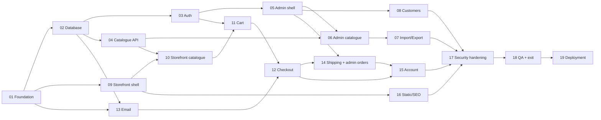

# Puja Essentials — Implementation Plans

These plans turn [`../DESIGN.md`](../DESIGN.md) (v1.3) into implementable, testable units of work. Each plan is one branch, one PR (split if the diff exceeds ~800 lines), one paste-ready prompt. Read this file once; every plan assumes its conventions.

---

## 1. How to use a plan

1. Open `NN-slug.md`. Check **Depends on** is merged.
2. `git checkout -b feat/pNN-slug` from `main`.
3. Paste the plan's **Implementation prompt** into Claude Code from the repo root. The prompt references the plan and the DESIGN.md sections; it does not repeat them.
4. Work test-first. The plan's **Test plan** is the contract; the **Definition of Done** is the merge gate.
5. Open a PR titled `[PNN] Title`, body = the DoD checklist with every box ticked and evidence (test output, screenshots for UI).
6. Run `/code-review` before requesting review; address CRITICAL/HIGH.

---

## 2. Plan index

| #   | Plan                                                         | Phase | Effort (dev-days) | Depends on   | Unblocks           |
| --- | ------------------------------------------------------------ | ----- | ----------------- | ------------ | ------------------ |
| 01  | Foundation: monorepo, CI, compose, ports skeleton            | 1     | 4                 | —            | everything         |
| 02  | Database schema, migrations, seed, test harness              | 1     | 3                 | 01           | 03–08, 10–15       |
| 03  | Auth, sessions, MFA, BFF cookies                             | 1     | 6                 | 02           | 05, 08, 11, 12, 15 |
| 04  | Catalogue API, media pipeline, Postgres search, revalidation | 1     | 5                 | 02           | 06, 07, 10         |
| 05  | Admin shell: RBAC, audit, staff, settings, security page     | 1     | 5                 | 03           | 06, 07, 08, 14     |
| 06  | Admin catalogue & inventory                                  | 1     | 4                 | 04, 05       | 07                 |
| 07  | Admin import / export                                        | 1     | 4                 | 06           | —                  |
| 08  | Admin customers & DPDP                                       | 1     | 3                 | 05           | 15                 |
| 09  | Storefront design system, shell, i18n scaffold               | 1     | 4                 | 01           | 10, 11, 15, 16     |
| 10  | Storefront catalogue pages (home, collection, PDP, search)   | 1     | 5                 | 04, 09       | 11                 |
| 11  | Cart (Valkey, drawer, merge)                                 | 1     | 3                 | 03, 10       | 12                 |
| 12  | Checkout, orders, GST, Razorpay                              | 1     | 7                 | 11, 13       | 14, 15             |
| 13  | Email notifications (templates, suppression, jobs)           | 1     | 3                 | 02, 01       | 12, 14, 15         |
| 14  | Shipping port, Shiprocket adapter, admin orders              | 1     | 5                 | 12, 05       | 15                 |
| 15  | Customer account                                             | 1     | 3                 | 12, 14       | 18                 |
| 16  | Static pages, policies, SEO, forms                           | 1     | 3                 | 09           | 18                 |
| 17  | Application security hardening & security test suite         | 1     | 4                 | all of 03–16 | 18                 |
| 18  | Phase 1 QA: E2E suite, visual/a11y/CWV, exit checklist       | 1     | 4                 | 17           | 19                 |
| 19  | Deployment & go-live (tier decision, infra, VAPT)            | 2     | 5–10              | 18           | 20+                |
| 20  | Search: Meilisearch adapter (+ blog)                         | 3     | 3                 | 19           | —                  |
| 21  | Wishlist & reviews                                           | 3     | 3                 | 19           | —                  |
| 22  | Returns & refunds                                            | 3     | 5                 | 19           | —                  |
| 23  | Coupons & promotions                                         | 3     | 4                 | 19           | —                  |
| 24  | Blog CMS, newsletter, related products                       | 3     | 4                 | 19, 20       | —                  |
| 25  | Ops: reconciliation, dashboard depth, exports                | 3     | 3                 | 19           | —                  |
| 26  | Partial pay, invoice PDF, bundles, festivals                 | 4     | 6                 | 22, 23       | —                  |
| 27  | i18n (Hindi + Tamil), analytics, CSP hashes                  | 4     | 6                 | 24           | —                  |
| 28  | Messaging: WhatsApp, SMS, share row                          | 5     | 4                 | 27           | —                  |

Effort assumes one engineer familiar with the stack. Phase 1 totals ≈ 75 dev-days: **~14–16 weeks solo, ~8 weeks with two engineers** running the tracks below in parallel. The DESIGN.md "weeks 1–8" assumes the latter.

---

## 3. Dependency graph and tracks

**Track A (backend):** 01 → 02 → 03 → 04 → 05 → 06 → 07 → 08 → 13 → 14
**Track B (frontend):** 09 → 10 → 11 → 12 → 15 → 16
**Joint:** 17 → 18 → 19

With one engineer, follow the numeric order; 09 can be interleaved after 03 for variety.

---

## 4. Engineering conventions (apply to every plan)

### Repository

Layout per DESIGN.md §13: `apps/web`, `apps/api`, `packages/shared`, `packages/config`, `tests/e2e`, `infra/` (Phase 2), `docker-compose.yml`. pnpm workspaces, Node 22 LTS (`.nvmrc`), TypeScript `strict` + `noUncheckedIndexedAccess`.

### Branches, commits, PRs

- Branch `feat/pNN-slug`; conventional commits (`feat(auth): …`, `fix(cart): …`, `test(orders): …`).
- One PR per plan. If a plan's diff would exceed ~800 lines, split into `pNN-a`, `pNN-b` in the order the plan's tasks list them; each part must be green on its own.
- PR body = the plan's DoD checklist, ticked, with evidence. Squash-merge.

### Code rules (from the workspace rules; enforced in review)

- Immutable data: return new objects, never mutate inputs. Reducers and services are pure where possible.
- Files ≤ 400 lines typical, 800 max; functions ≤ 50 lines; nesting ≤ 4.
- Validate at boundaries with Zod (`.strict()`); trust internal calls.
- Errors: Fastify error handler maps to the envelope `{ success:false, data:null, error:{ code, message } }`; never leak stack traces or internal IDs; every error `code` is a stable string listed in `packages/shared/src/errors.ts`.
- No comments that explain _what_; only _why_ when non-obvious.
- No feature flags for sequencing; merge order is the sequence.

### Testing (the contract for "testable")

| Layer       | Tool                                                                      | Where                                         | What it proves                                                                                  |
| ----------- | ------------------------------------------------------------------------- | --------------------------------------------- | ----------------------------------------------------------------------------------------------- |
| Unit        | Vitest                                                                    | `*.test.ts` beside the code                   | Pure logic: money, tax, validators, state machines, reducers                                    |
| Integration | Vitest + Testcontainers (Postgres 16, Valkey 8, MinIO) + Fastify `inject` | `apps/api/test/int/**`                        | Real DB/queue/storage behaviour: constraints, transactions, IDOR scoping, webhooks, rate limits |
| Contract    | Vitest + recorded fixtures                                                | `tests/fixtures/{razorpay,shiprocket}/*.json` | Our parsers/verifiers against real provider payloads                                            |
| E2E         | Playwright against `docker compose`                                       | `tests/e2e/**`                                | User journeys across web + API + DB; OTPs read from Mailpit's API; payment via the test stub    |
| Security    | Vitest + ZAP baseline (plan 17)                                           | `apps/api/test/security/**`                   | Enumeration, IDOR, CSRF, cookie attributes, alg confusion, injection guards                     |

- **Never mock Prisma or the database in integration tests.** Mock only external HTTP (Razorpay, Shiprocket) at the boundary with `msw`, or use a port's fake adapter.
- Tests use AAA structure and behaviour-named titles (`rejects a rotated refresh token and revokes the family`).
- Coverage (v8) thresholds enforced in each `vitest.config.ts`: **80 % lines/branches/functions** per app and package; **95 %** for `packages/shared/src/{money,tax}` and `apps/api/src/modules/{auth,cart,orders,payments,tax}`. Thresholds fail the build; do not lower them — add tests.
- Integration DB per test file: migrations applied once per container; tables truncated between tests via `resetDb()` from `apps/api/test/helpers/db.ts` (plan 02).
- `NODE_ENV=test` unlocks: `RATE_LIMIT_MULTIPLIER`, the payment stub route, deterministic OTP hook for E2E (plan 18). Each is asserted at boot to be unavailable otherwise.

### CI gates (`.github/workflows/ci.yml`, plan 01)

`lint` → `typecheck` → `unit` (coverage) → `integration` (Docker) → `build` (both images) → `security` (Semgrep `p/typescript p/nodejs p/owasp-top-ten`, gitleaks, `pnpm audit --audit-level=high`, Trivy fs + image) → `e2e` (plan 18 turns it on for PRs touching `apps/**`). Actions pinned by SHA. All gates required on `main`.

### Environment and secrets

- Every variable in `.env.example` with a comment; `packages/shared/src/env.ts` Zod schemas validate at boot and fail fast.
- Never commit `.env`. Secrets in tests are fixed dummy values checked into `test/fixtures/env.test`.
- Local stack: `docker compose up -d` → Postgres `5432`, Valkey `6379`, MinIO `9000` (console `9001`), Mailpit SMTP `1025` / UI+API `8025`.

### Definition of Done (global — every plan adds its own specifics)

- [ ] All tasks in the plan complete; nothing marked TODO in code
- [ ] Unit + integration tests written first and green; coverage thresholds met
- [ ] E2E scenarios listed in the plan pass on the compose stack (where the plan has any)
- [ ] `pnpm lint && pnpm typecheck && pnpm test` clean; CI green including security job
- [ ] No new `pnpm audit` high/critical; no secrets in diff (gitleaks clean)
- [ ] Error paths return the envelope with stable codes; logs redact PII
- [ ] DESIGN.md §4.2 hosting-agnostic rules respected (env-only config, ports, no cloud SDK for config)
- [ ] `/code-review` run; CRITICAL/HIGH resolved
- [ ] `.env.example`, README and any ADR updated

### Plan file template

`Goal · Scope (In/Out) · Deliverables · Tasks (ordered) · Contracts · Test plan (unit/integration/E2E/security/coverage) · Definition of Done · Senior engineer review notes · Implementation prompt`

---

## 5. Cross-cutting senior-review findings

These were found while decomposing DESIGN.md into plans. Each is a decision; the affected plans implement it.

| #   | Finding                                                                                                        | Decision                                                                                                                                                                                                                                                                                                                                                                                       | Plans      |
| --- | -------------------------------------------------------------------------------------------------------------- | ---------------------------------------------------------------------------------------------------------------------------------------------------------------------------------------------------------------------------------------------------------------------------------------------------------------------------------------------------------------------------------------------- | ---------- |
| R1  | SSR of `/account` and `/admin` needs server-side auth, but the design said the access token lives "in memory". | **BFF pattern.** The browser only talks to Next.js. `apps/web/app/api/[...path]/route.ts` proxies to Fastify, injecting `Authorization: Bearer` from an `__Host-access` httpOnly cookie; refresh/CSRF cookies are also on the web origin. Fastify listens on the private network only and stays Bearer-only. Server components verify the JWT locally with the public key (no API round-trip). | 03, 09     |
| R2  | `/search` is "Must" in Phase 1 but Meilisearch is Phase 3.                                                     | `SearchPort` with a **Postgres full-text adapter** (generated `tsvector` + `pg_trgm` GIN) in Phase 1; Meilisearch adapter in plan 20 behind the same port.                                                                                                                                                                                                                                     | 02, 04, 20 |
| R3  | OTP (plan 03) needs email before the email plan (13).                                                          | Port interfaces and local adapters (SMTP→Mailpit, S3→MinIO, env `KeyProvider`, fake shipping) are scaffolded in **plan 01**. Plan 03 sends OTP through `EmailPort` with a minimal template; plan 13 owns the template system and notification jobs.                                                                                                                                            | 01, 03, 13 |
| R4  | Razorpay has no sandbox webhooks you can trigger locally.                                                      | Test-mode keys; **recorded webhook fixtures** under `tests/fixtures/razorpay/` signed in tests with the test webhook secret; a local replay script posts them to the API. E2E uses a **payment stub** route mounted only under `NODE_ENV=test`.                                                                                                                                                | 12, 18     |
| R5  | Shiprocket has no sandbox at all.                                                                              | `ShippingPort` with a deterministic `FakeShippingAdapter` (serviceability by PIN prefix, fake AWBs, scripted status progression). The real `ShiprocketAdapter` is written against recorded response fixtures and first exercised on staging in plan 19.                                                                                                                                        | 01, 14, 19 |
| R6  | Field-level encryption must work locally without KMS.                                                          | `KeyProvider` interface; `EnvKeyProvider` (AES-256-GCM, 32-byte key from env; separate HMAC key for blind indexes) applied through a **Prisma client extension** on a declared field map. Production adapter in plan 19.                                                                                                                                                                       | 01, 02     |
| R7  | Cached `variant.stock` can drift from the ledger.                                                              | Stock changes only through `inventory.apply(movement)` inside the same transaction that writes `StockMovement`; nightly `ledger-check` job alerts on drift.                                                                                                                                                                                                                                    | 02, 06, 12 |
| R8  | ISR pages go stale after admin edits.                                                                          | Next route `POST /api/internal/revalidate` (shared secret) calling `revalidateTag`; the API fires it after catalogue writes with retry. Pub/sub deferred to Phase 4.                                                                                                                                                                                                                           | 04, 09, 10 |
| R9  | GST-inclusive price splitting needs an explicit rounding rule.                                                 | `splitGst(pricePaise, rate, destinationState)`: `taxable = round(price × 100 / (100 + rate))`, `tax = price − taxable`; TN → CGST = ceil(tax/2), SGST = tax − CGST; else IGST = tax. Pure, exhaustively unit-tested, in `packages/shared`.                                                                                                                                                     | 01, 12     |
| R10 | Duplicate order creation on retries.                                                                           | `Idempotency-Key` header on `POST /orders`; Valkey `idem:{userId}:{key}` holds `{status, response}` for 24 h; concurrent duplicate returns `409 IDEMPOTENCY_IN_PROGRESS`.                                                                                                                                                                                                                      | 12         |
| R11 | Time zones.                                                                                                    | Store UTC; render IST in the web app; return window = `deliveredAt + 15 × 24 h`.                                                                                                                                                                                                                                                                                                               | 12, 15, 22 |
| R12 | Adding locales later is a routing rewrite if not planned.                                                      | `app/[locale]/` segment with `next-intl` and **only `en`** from plan 09; `messages/en.json` from day one. Admin lives outside the segment.                                                                                                                                                                                                                                                     | 09, 27     |
| R13 | Admin and storefront share one Next app.                                                                       | `middleware.ts` gates `/admin` on `aud=admin` in the access cookie and `/account`, `/checkout` on any valid session; the API enforces RBAC independently.                                                                                                                                                                                                                                      | 03, 05     |
| R14 | Testcontainers needs Docker in CI.                                                                             | GitHub-hosted Ubuntu runners have Docker; the `integration` job runs containers directly. E2E job brings up the compose stack.                                                                                                                                                                                                                                                                 | 01, 18     |
| R15 | Rate limits make E2E flaky.                                                                                    | `RATE_LIMIT_MULTIPLIER` env honoured only when `NODE_ENV=test`; specific rate-limit tests set it to `1`.                                                                                                                                                                                                                                                                                       | 03, 17     |
| R16 | Rich text rendering.                                                                                           | Store Tiptap JSON; API renders HTML on read via `@tiptap/html` → `sanitize-html`; the web app only ever receives sanitised HTML strings and renders them without further processing.                                                                                                                                                                                                           | 04, 10     |
| R17 | `orderNumber` uniqueness under concurrency.                                                                    | Postgres sequence per year (`order_number_seq_2026`) created by migration; formatted `PE-YYYYNNNN`; no application-side counters.                                                                                                                                                                                                                                                              | 02, 12     |
| R18 | Plan sizing.                                                                                                   | No plan > 7 dev-days; anything larger was split. If a plan runs long, split the PR, not the tests.                                                                                                                                                                                                                                                                                             | all        |

---

## 6. Risk register

| Risk                                                     | Impact                      | Mitigation                                                                                   |
| -------------------------------------------------------- | --------------------------- | -------------------------------------------------------------------------------------------- |
| Razorpay live-key and webhook-secret provisioning delays | Blocks go-live              | Request in week 1 of Phase 2; all logic proven with test keys in Phase 1                     |
| Shiprocket API differences from fixtures                 | Wrong labels/tracking       | Adapter isolated; contract tests updated on staging in plan 19                               |
| Next.js 15 / React 19 API churn                          | Rework                      | Pin versions in plan 01; upgrade only via Renovate PR with green E2E                         |
| Coverage thresholds slow delivery                        | Pressure to skip tests      | Thresholds are per-module and realistic; tests are written first so the cost is front-loaded |
| Scope creep into Phase 1 (Tamil, WhatsApp, returns UI)   | Delay                       | Out-of-scope lists in every plan; those features have their own plans                        |
| Prisma cannot express generated columns / triggers       | Drift between schema and DB | Raw SQL migrations for those objects + `prisma migrate diff` check in CI                     |

---

## 7. Glossary

**BFF** — backend-for-frontend: Next.js route handlers that proxy to the API and own cookies. **Port/adapter** — interface in `apps/api/src/ports` with local/prod implementations. **Ledger** — `StockMovement` rows; `variant.stock` is a cache. **Step-up** — fresh TOTP within 5 min, expressed as `amr: ["step-up"]` in the access token. **Idempotency key** — client-supplied header that makes `POST /orders` safe to retry.
